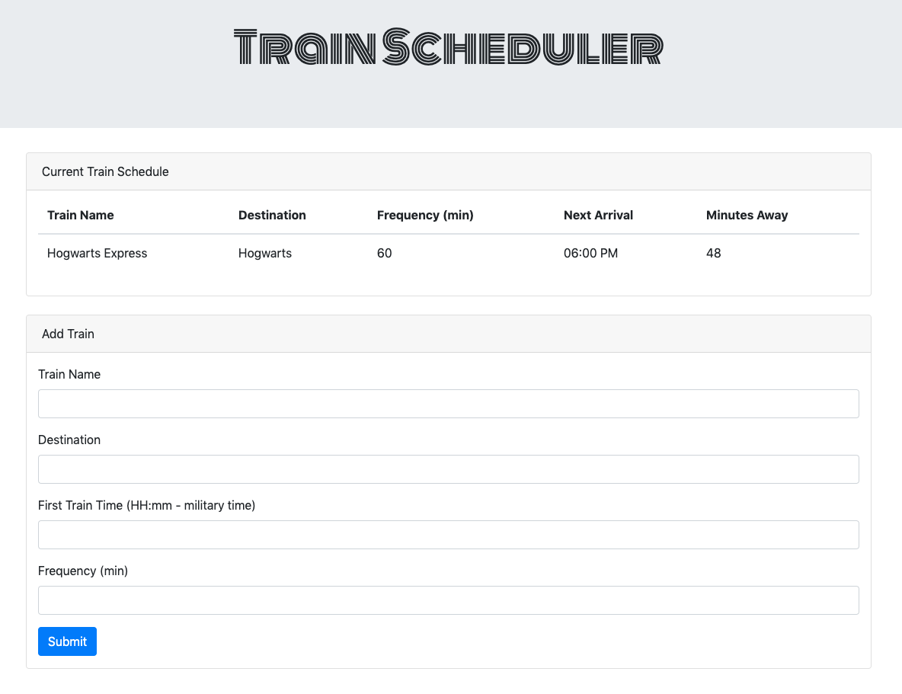

# Train Scheduler

## About

Train Scheduling App with database storage capabilities.

## Getting Started

[Test it out](https://mahume.github.io/train-scheduler/)

1. Enter Train Name
2. Enter final destination
3. Enter time in military format (16:25)
4. Enter arrival frequency of Train
5. Click Submit to add information to database and populate chart

## Technologies

Built using using core front-end technologies. Basic structure using HTML5. Layout and styling done with Bootstrap4's grid system and CSS3. Functionality is written with a combination of jQuery and vanilla JavaScript. Data storage is done using Firebase.

- HTML5
- CSS3
  - Bootstrap 4
- JavaScript
  - jQuery
- Firebase

## Authors

[Mike Hume](https://mahume.github.io/)

